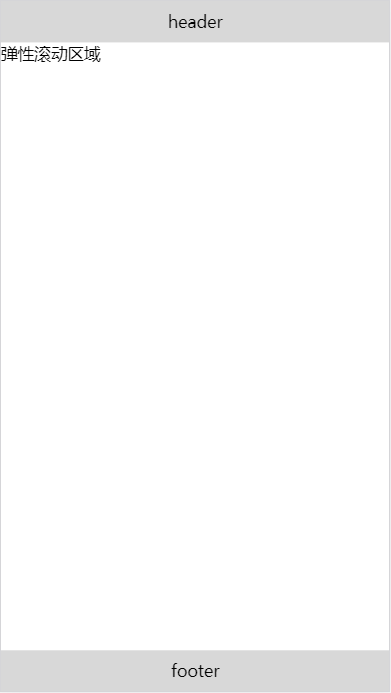

<!--more-->

# css部分

```bash
html,body{height:100%; margin: 0; padding: 0;}
.wrap{display:-webkit-box;
    display:-webkit-flex;
    display:-ms-flexbox;
    display:flex;
    -webkit-box-orient:vertical;
    -webkit-flex-direction:column;
    -ms-flex-direction:column;
    flex-direction:column;
    width:100%;height:100%;}
.header,.footer{height:40px;line-height:40px;background-color:#D8D8D8;text-align:center;}
.main{-webkit-box-flex:1;-webkit-flex:1;-ms-flex:1;flex:1;width:100%;}
```

# html部分

```bash
<div class="wrap">
    <div class="header">header</div>
    <div class="main">
        弹性滚动区域
    </div>
    <div class="footer">footer</div>
</div>  
```

> 最后效果




 

