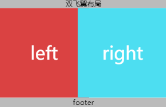

<!-- more -->

## 圣杯布局

1. css

```bash
    * {
        padding: 0;
        margin: 0;
    }
    body {
        min-width: 600px;
    }
    header,
    footer {
        text-align: center;
        width: 100%;
        background-color: #bbbbbb;
    }
    .text {
        text-align: center;
        line-height: 200px;
        font-size: 40px;
        color: #fff;
    }
    .bd {
        overflow: hidden;
        padding: 0 200px 0 200px;
    }
    .main {
        float: left;
        width: 100%;
        height: 200px;
        background-color: #ddd;
    }
    .left {
        /* opacity: 0.5; */
        float: left;
        width: 200px;
        height: 200px;
        background-color: #da4242;
        /* 产生布局效果的属性 */
        margin-left: -100%;
        position: relative;
        left: -200px;
    }
    .right {
        /* opacity: 0.5; */
        float: left;
        width: 200px;
        height: 200px;
        background-color: #4ddef1;
        /* 产生布局效果的属性 */
        margin-left: -200px;
        position: relative;
        left: 200px;
    }
```

2.html部分

```bash
 <header>圣杯布局</header>
    <div class="bd">
        <div class="main text">
            main
        </div>
        <div class="left text">
            left
        </div>
        <div class="right text">
            right
        </div>
    </div>
<footer>footer</footer>
```

## 双飞翼布局

1. css

```bash
    * {
        padding: 0;
        margin: 0;
    }
    header,
    footer {
        text-align: center;
        width: 100%;
        background-color: #bbbbbb;
    }
    .text {
        text-align: center;
        line-height: 200px;
        font-size: 40px;
        color: #fff;
    }
    .bd {
        overflow: hidden;
    }
    .main {
        float: left;
        width: 100%;
        height: 200px;
        background-color: #ddd;
    }
    .main-content {
        margin: 0 200px;
    }
    .left {
        float: left;
        width: 200px;
        height: 200px;
        background-color: #da4242;
        /* 产生布局效果的属性 */
        margin-left: -100%;
    }
    .right {
        float: left;
        width: 200px;
        height: 200px;
        background-color: #4ddef1;
        /* 产生布局效果的属性 */
        margin-left: -200px;
    }
```

2.html部分

```bash
<header>双飞翼布局</header>
<div class="bd">
    <div class="main text">
        <div class="main-content">main</div>
    </div>
    <div class="left text">
        left
    </div>
    <div class="right text">
        right
    </div>
</div>
<footer>footer</footer>
```

### 两种方式实现效果图



>  运用flex实现

1. css

```bash
   *{
        box-sizing:content-box;/* 伸缩项目自动box-sizing:border-box，所以需调整为content-box */
        margin:0;
        padding:0;
    }

    body{
        display:flex;
        flex-direction:column;/* 头、中部、脚纵向显示 */
    }

    header,footer{
        flex:0 0 50px;/* 头、脚尺寸固定，不放大、不缩小 */
        background:#3f3f3f;
    }

    .main{
        display:flex;

        /* 
        flex:1 == 1 1 auto：剩余空间放大比例(flex-grow)  空间不足缩小比例(flex-shrink)    分配多余空间之前项目占据的主轴空间(flex-basis)
        flex:1指的是：中部区域自由伸缩
        auto指的是项目本来大小，因未给main设置高度,main高度由子元素最高者决定，若子元素高度为0，则main高度为0
        块级元素未主动设置高度或未被子元素撑起高度，浏览器默认为块级元素分配高度为0。
        */
        flex:1;
    }

   .content{
        background:red;
        height:1000px;

        /* 
        横向中间内容区自适应，即使未指定宽度，但会分配宽度 
        块级元素未主动设置宽度或未被子元素撑起宽度，浏览器默认为块级元素分配宽度为可使用的全部宽度，比如全屏宽。
        */
        flex:1;
   }
   .left,.right{
        height:800px;
        background:blue;
        flex:0 0 100px;/* 左右两列固定宽 */
   }

   .left{
        order:-1;/* 让left居于左侧 */
   }
```

2.html部分

```bash
<header></header>
    <div class="main">
        <div class="content"></div>
        <div class="left"></div>
        <div class="right"></div>
    </div>
<footer></footer>
```
