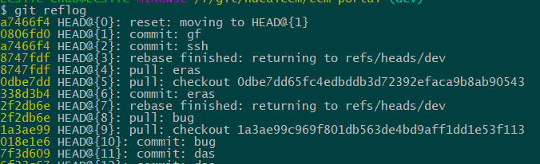
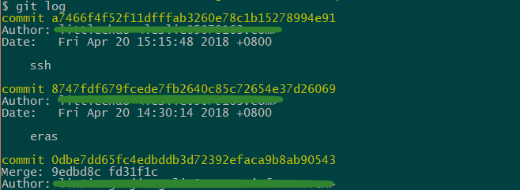

# 1.生成秘钥文件
```bash
  ssh-keygen -t rsa -b 4096 -C "youemail@exemple.com" -f ~/.ssh/git-hub-rsa
```
# 2.在ssh文件目录下创建config文件
```bash
# code.aliyun.com
Host code.aliyun.com
    HostName code.aliyun.com
    PreferredAuthentications publickey
    IdentityFile ~/.ssh/aliyun_id-rsa
# github
Host github.com
    HostName github.com
    PreferredAuthentications publickey
    IdentityFile ~/.ssh/id_rsa
# github
Host github.com
    HostName github.com
    PreferredAuthentications publickey
    IdentityFile ~/.ssh/git-hub-rsa
```

## git操作

# git commit -m "exemple" 提交成功了想要回退

```bash

git reflog

git reset --soft HEAD@[1]   //commit还在缓存区
git reset --hard HEAD@[1]   //commit还在缓存区

```



# git push 提交了以后回退

```bash
git log
```



```bash
git reset --hard 3628164  //版本号前几位
```